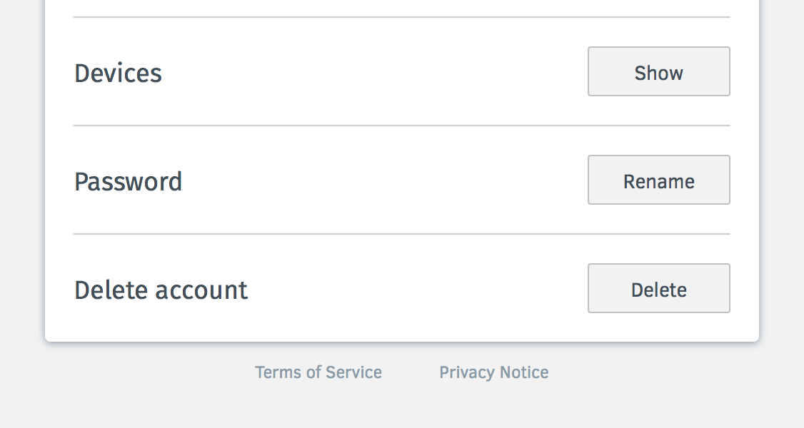
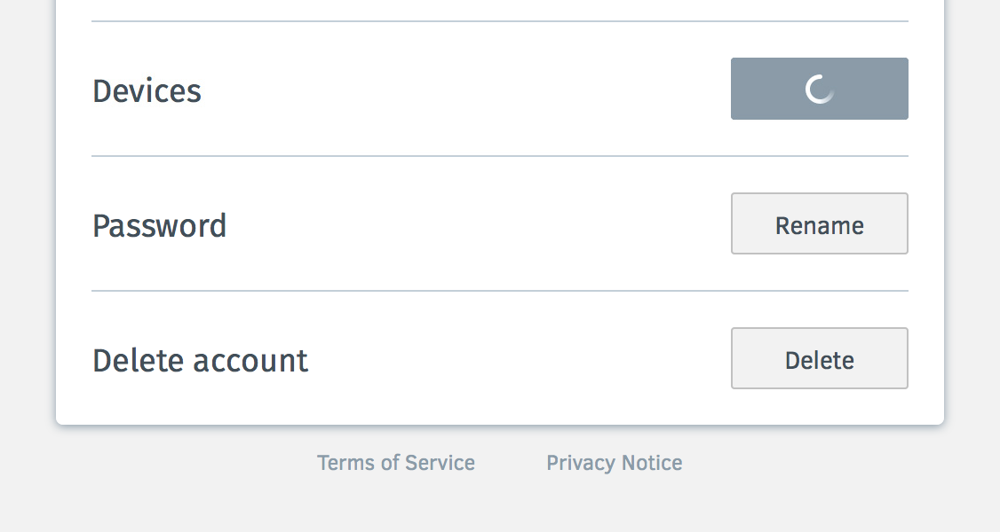
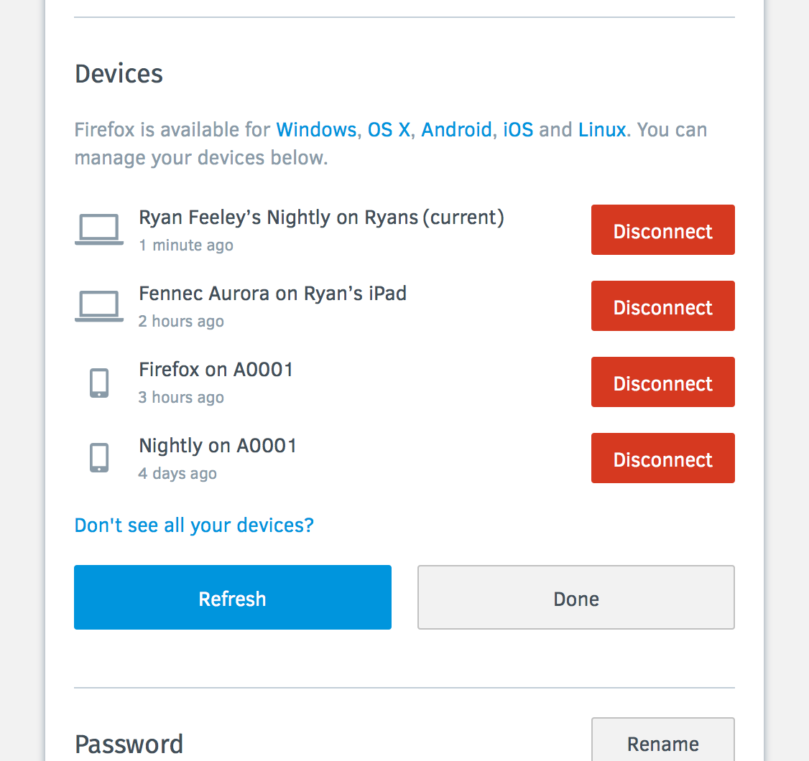
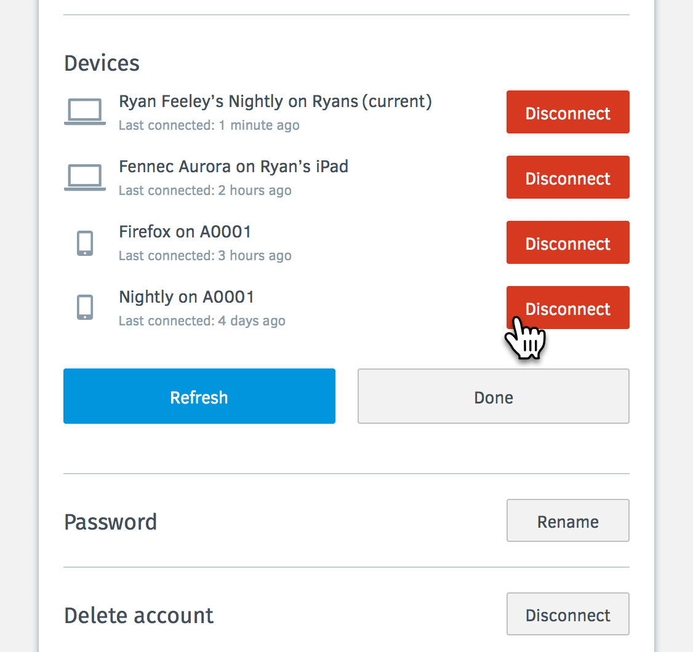

Device View - Basic UI
======================

https://mozilla.aha.io/features/FXA-16

Stories
-------

As a FF user when using Firefox,
I want to know the devices that are connected to my Firefox Account,
and important information about the status of those devices.

I want my FF devices to be logically named
so I recognize them and have the ability to rename them.
I want to easily see the type and browser details of the each device,
and to be able to identify the device I am currently using.

I want a place to go when I think that something might be wrong with Sync,
to see when each device last checked in with the Mozilla servers.

I want a place to go when I think that my account
may have been used without my permission,
to check what devices are connected
and to disconnect devices that I do not recognize.

UI Mocks
--------

## Assets

## Collapsed View
When the user is syncing one or more devices, a **Devices** section appears in the settings section above the **Password** section.

## Fetching Devices View
When the user clicks the **Show** button, and the server has to fetch the images, the **Show** button becomes disabled and is replaced with a spinning wheel (halved in size from full size spinning wheel).

## Minimal View (no rename)
When the user expands the **Device** section, the Firefox profiles that are syncing through this account are presented with the relative time they last authenticated to sync, with a **Disconnect** button beside each.

## Disconnecting View (no rename)
When the user clicks and releases the **Disconnect** button, the row is overtaken by the area beneath it.

Details
-------

#### What is a "device"?

By "device" here we mean "an instance of Firefox".
There is no separate notion of having multiple "browsers" on a single "device".
Technically the concept is closer to "profiles"
but this is not a good name to present the users.

* When I use a desktop machine
  and connect both Firefox Release and Firefox Nightly to my account,
  they appear as two separate devices.
  There will be no indicatiion that they're on the same physical machine
  apart from similarity in their auto-generated name and their UA details.

* When I use Firefox for Android or Firefox for iOS...
  TODO what exactly do we expect to happen?

* When I use a FirefoxOS device,
  it appears in the view as a single device
  since the connetion is managed at the system level.
  Also, TODO do we care at this stage?

For the initial version, only things that connect to sync count as devices.

* When I log in to Marketplace with my Firefox Account,
  using the web-based flow in a browser that is not connected to my account,
  the resulting session does *not* appear in the list of devices.

* When I log in to Pocket with my Firefox Account
  using non-Firefox web browser,
  the resulting session does *not* appear in the list of devices.

* When I have existing Firefox instances
  that are already connected to sync,
  they will appear in the devices view automatically.

* TODO this also means that FirefoxOS should not be in the list
  because it doesn't connect to sync yet.
  It will soon though and it's something for us to think about.
  

#### What details do we show about the device?

For each device we will show:

* The human-readable name for the device,
  either an auto-generated one or one provided by the user.

* The time it was last seen,
  i.e. the times at which it last used its session token
  to interact with the FxA servers.

* The browser type and version,
  and operating system platform and version,
  where this information is available in the user-agent string
  provided by the device.

* Whether or not the device's login state is still valid
  (it could be  in the "need to re-authenticate" state after password reset).

* Whether it is the device currently viewing the devices view.

#### Disconnecting devices

When I sign out of Firefox Sync through the browser's UI,
the session token belonging to that device is destroyed
and all information about the device is removed from the server.
It no longer appears in the devices view.

When I view the devices list from a device that is connected to my account,
I do not have the ability to disconnect that device,
because this would be a confusing user experience.
I must disconnect it through the device's native UI.

When I disconnect a device through the devices view,
the session token belonging to that device is destroyed,
all information about the device is removed from the server,
and if the device has registered a push endpoint
then it receives a push notification from the server.
The device responds by:

* If it is an older version of Firefox,
  it will only discover that it has been disconnected
  when it next attempts to sync
  and finds that its session token is invalid.
  It will enter the "needs to reauthenticate" state.

* If it is a newer version of Firefox,
  it will respond to the push notification of its disconnection
  by immediately returning to the "not connected to sync" state.

#### Interaction with Password Reset

When I reset my password
it does not cause my devices to be completely removed from the account,
but it does invalidate their session tokens
which will cause them to enter the "needs to reauthenticate" state.

Devices without a session token
will have an affordance in the devices view
to indicate that they are not properly connected.

When I re-authenticate on a device
that had its session token invalidated,
it will appear in the devices view
with the same name and details that it previously had.
It will *not* appear as an additional device.

#### Device naming and editing

When I connect a new device to my account
it will receive a default human-readable name
that gives me a reasonable chance of identifying it.

I can edit the name of the device
on the web through the devices view
as well as in the browser's native UI
in the sync preferences page.
Changes made in one location are reflected in the other.

The device name presented in the devices view
will match the device name presented in the browser's native UI
for features such as "synced tabs".

#### Real-time updates

When I have the devices view is open in Firefox
and I change any device-related state through that device,
the devices view updates to reflect the change in realtime,
regardless of whether the change originated in web content
or through the browser's native UI.

When I have the devices view is open in Firefox
and I change any device-related state through a different device,
the devices view does not need to update in realtime,
but it can be manully refreshed by the user
in order to view the latest state of the account.
>>>>>>> First draft of detailed requirements for "FxA-16: devices view"
