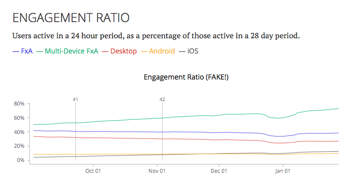
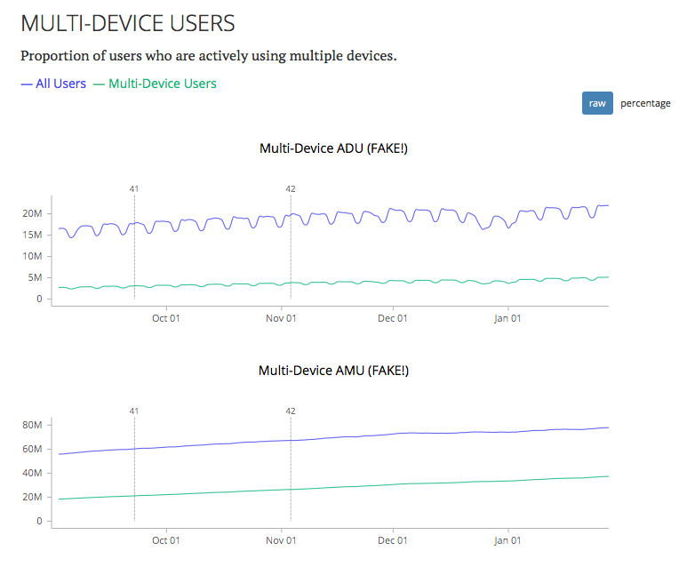
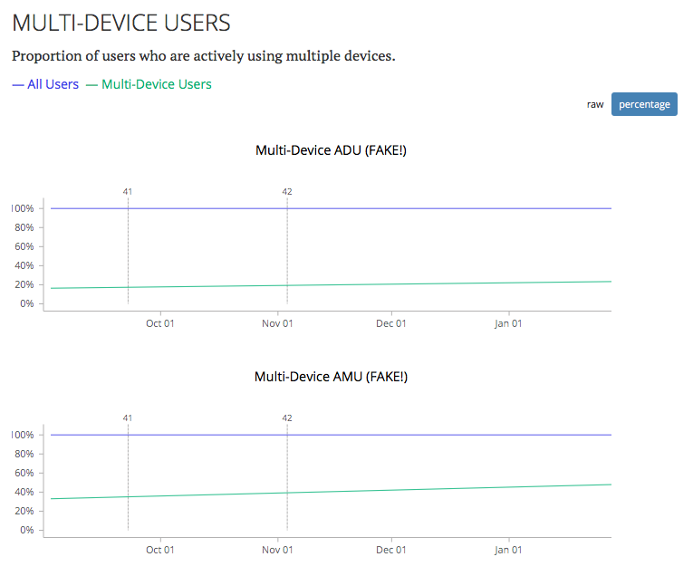
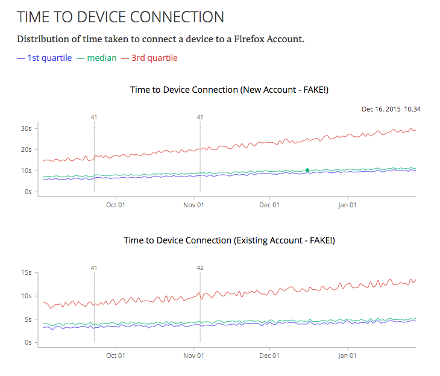

2016 KPI Dashboards
===================

https://mozilla.aha.io/features/FXA-70

## Stories

As a product stakeholder for Firefox Accounts
I want to quickly see the key metrics we care about for the year
and how they're changing over time.

## Overview

The top-line objective for FxA in 2016 is to
*seamlessly connect users to a compelling Firefox experience
on all their devices*.
To support this we will build a KPI dashboard
that focusses on three key metrics:

* Engagement Ratio,
  as a measure of whether
  they find the experience compelling.
* Multi-Device Usage,
  as a measure of how well we are
  being present on all the user's devices.
* Time taken for device connection,
  as a measure of how seamlessly
  we are making the connection.

By default,
each of these measures will be presented
as an aggregation over all users.
Linked detail dashboards will display them
broken out by key user segmentation characteristics
such as browser version,
os platform,
and whether they are a multi-device user.

### Engagement Ratio

This is the ratio of daily active users
as a percentage of monthly active users,
and is a measure of whether we have
a compelling Firefox Experience.
It does not meaningfully represent ongoing engagement
with Firefox Accounts itself,
since we're largely a background service
once the user has connected their devices.

To reflect this dependence on broader Firefox engagement levels,
our target for 2016 will be twofold:

* Increase engagement ratio by 5 percentage points over 2015 baseline.
* Achieve at least 5 percentage points *higher* engagement ratio
  than the overall ratio for each of Firefox desktop, Android and iOS.

TODO: establish baselines

TODO: sanity-check reasonableness of goals

The top-level KPI dashboard will show a graph of
engagement ratio, calculated daily,
for Firefox Accounts
alongside each of Firefox desktop, Android and iOS.
It will also show the engagement ratio
specifically for multi-device users.
It will look something like this:

---

---

A linked detail dashboard can present
engagement ratio alongside the underlying DAU and MAU,
broken down by platform
and by single/multi-device users.
This will be designed and implemented
as follow-up work.

### Multi-device usage

We will track the ratio of active multi-device users
as a proportion of our overall active user base,
as a measure for how well we are fulfilling our objective
to be present on all the user's devices.

Our target for 2016 will be:

* At least 20% of daily active users are multi-device users.

TODO: establish baseline.

TODO: figure out a reasonable goal if "20%" seems too far-fetched.

The top-level KPI dashboard will show
the proportion of active users
who were classified as multi-device
on a daily and monthly basis,
compared to the overall active user count
for each period.
It will default to showing the raw counts
and look something like this:

---

---

But can be easily toggled
to show the count on a a percentage basis,
like this:

---

---

### Time taken to connect a device

We will measure the time taken
between initiating an attempt to connect a device
and that device being ready to sync.
This will provide a coarse measure of
the seamlessness of the connection experience.

Our target for 2016 will be:

* median time-to-device-connection of less than ten seconds
  when creating a new account.
* median time-to-device-connection of less than five seconds
  when using an existing account.

TODO: establish baseline

TODO: figure out a reasonable goal if "ten" and "five" seem too far-fetched.

The top-level dashboard will show graphs of
the median and quartiles for time-to-device-connection,
reported on a daily basis,
separated by new-account and existing-account connections.
It will look something like this:

---

---

A linked detail dashboard can present
this data broken down by geographic region,
as well as timing data for individual steps
of the setup process.
This will be designed and implemented
as follow-up work.

To account for
failed or aborted connection attempts,
we will also show the completion rate
as a percentage
in the linked detail view.

## Details

### Definitions

To avoid ambiguity
and ensure alignment with metrics
generated by other teams at Mozilla,
we'll use the following concrete definitions
of the data of interest:

* "Active user" refers to a specific FxA user id,
  and means that we recorded at least one activity event
  associated with that userid
  in the time period in question.

* "Active device" refers to a specific FxA device id,
  and means that we recorded at least one activity event
  associated with that device id
  in the time period in question.

* "Daily active users" or "DAU" means
  the number of distinct user ids
  for which we have at least one activity event in our logs
  during a given UTC day.

* "Monthly active users" or "MAU" on a given day means
  the number of distinct user ids
  for which we have at least one activity event in our logs
  during the previous 28 UTC days.

* "Engagement ratio" on a given day means
  the mean DAU over the previous 7 days,
  divided by the MAU for that day,
  expressed as a percentage.

* A userid is a "multi-device user" on a given day
  if their account had an active device on that UTC day,
  and had an active device with a different device id
  in the previous five UTC days.

* "Multi-Device DAU" means
  the number of distinct user ids
  which counted as multi-device users on a given UTC day.

* "Multi-Device MAU" on a given day means
  the number of distinct user ids
  which counted as multi-device users
  at any time during the previous 28 UTC days.

* "Multi-Device engagement ratio" on a given day means
  the mean multi-device DAU over the previous 7 days,
  divided by the multi-device MAU for that day,
  expressed as a percentage.

* A device is "ready to sync"
  when it has registered a device metadata record
  with the FxA auth backend,
  and it has successfully fetched encryption keys
  from the server.

* "Time to device connection" means the time elapsed,
  in seconds,
  between the device first requesting connection UI
  from the FxA front-end servers,
  and the device being ready to sync.

The definition of a "multi-device user" here
is somewhat arbitrary,
but is designed to capture
users who are actively engaged in a "multi-device experience".
Only counting users with
multiple devices active on a single day
would seem too restrictive to
encompass more casual users,
while counting devices used weeks apart
would not seem to capture what's really meant
by "multi-device experience".

### Data Capture and Storage

We will use AWS Redshift as the canonical store
for all our KPI-related metrics data,
and will extend our existing "activity events" metrics stream
to track all the information required
to generate these KPI dashboards.
All events will be generated server-side.

All the events generated
by a particular user interaction with FxA
will be grouped into a "flow"
via a shared random identifier.
This will enable us to correlate events
across time and across services.
For example,
a flow might consist of individual events for
the user initiating a connection attempt,
successfully creating an account,
and successfully connecting their device.

All generated events will be stored
into a single table
with the following core event-data columns:

* **timestamp**:  UTC timestamp at which the event occurred, in milliseconds
* **flowId**:  a unique id for a particular user interaction flow spanning multiple events
* **flowTime**:  time in milliseconds between the beginning of the flow and this event
* **type**:  event type; see below
* **uid**:  user id that generated the event, if known
* **deviceId**:  device id that generated the event, if known

Each event will also be tagged
with contextual information
to enable us to break down metrics
by key user segmentation characteristics.
The following will be additional columns
on the redshift table:

* **newUser**:  whether the event involved a new user signup flow
* **userAgentBrowser**: browser name from UA string
* **userAgentVersion**: browser version number from UA string
* **userAgentOS**: platform name from UA string
* **service**: service or oauth client identifier
* **context**: auth-broker context identifier
* **entrypoint**: service or oauth client identifier
* **migration**: service migration identifier, e.g. 'sync11' or 'amo'
* **utm_campaign**: marketing campaign identifier
* **utm_content**: marketing campaign content identifier
* **utm_medium**: marketing campaign medium
* **utm_source**: marketing campaign source
* **utm_term**: marketing campaign search term

All events in a flow
will have the same tags,
but storing them as properties of each event
makes queries easier.
Additional tags can be added as required
in future.

The following event types will be emitted
by the FxA servers:

* **flow.begin**: emitted when the user begins interaction by requesting a page
* **account.created**: emitted when a signup is successfully completed
* **account.login**: emitted when a signin is successfully completed
* **account.verified**: emitted when the account email is successfully verified
* **account.keyfetch**: emitted when encryption keys are successfully fetched
* **account.reset**: emitted when an account reset is successfully completed
* **account.deleted**: emitted when an account deletion is successfully completed
* **account.signed**: emitted when a certificate is successfully signed
* **device.created**: emitted when a device record is successfully created
* **device.deleted**: emitted when a device record is successfully deleted

Some example event data
might look like the following:

<table>
  <tr>
    <th>timestamp</th>
    <th>flowId</th>
    <th>flowTime</th>
    <th>type</th>
    <th>uid</th>
    <th>deviceId</th>
    <th>newUser</th>
    <th>userAgentBrowser</th>
    <th>userAgentVersion</th>
    <th>userAgentOS</th>
    <th>service</th>
    <th>context</th>
    <th>entrypoint</th>
    <th>migration</th>
    <th>utm_campaign</th>
    <th>utm_content</th>
    <th>utm_medium</th>
    <th>utm_source</th>
    <th>utm_term</th>
  </tr>
  <tr>
    <td>1456434139863</td>
    <td>e17f606faf93812dfc45bdb308390119</td>
    <td>0</td>
    <td>flow.begin</td>
    <td>NULL</td>
    <td>NULL</td>
    <td>0</td>
    <td>Firefox</td>
    <td>40</td>
    <td>Windows 7</td>
    <td>sync</td>
    <th>fx_desktop_v2</th>
    <td>firstrun</td>
    <td>NULL</td>
    <td>NULL</td>
    <td>NULL</td>
    <td>NULL</td>
    <td>NULL</td>
    <td>NULL</td>
  </tr>
  <tr>
    <td>1456434152520</td>
    <td>e17f606faf93812dfc45bdb308390119</td>
    <td>12657</td>
    <td>account.created</td>
    <td>1161b57840f20ad4ea19ea0a87a99632</td>
    <td>NULL</td>
    <td>1</td>
    <td>Firefox</td>
    <td>40</td>
    <td>Windows 7</td>
    <td>sync</td>
    <th>fx_desktop_v2</th>
    <td>firstrun</td>
    <td>NULL</td>
    <td>NULL</td>
    <td>NULL</td>
    <td>NULL</td>
    <td>NULL</td>
    <td>NULL</td>
  </tr>
  <tr>
    <td>1456434152525</td>
    <td>e17f606faf93812dfc45bdb308390119</td>
    <td>20417</td>
    <td>device.created</td>
    <td>1161b57840f20ad4ea19ea0a87a99632</td>
    <td>3ccdd1cb9c3bee8a2d1750c4754d00c6</td>
    <td>1</td>
    <td>Firefox</td>
    <td>40</td>
    <td>Windows 7</td>
    <td>sync</td>
    <th>fx_desktop_v2</th>
    <td>firstrun</td>
    <td>NULL</td>
    <td>NULL</td>
    <td>NULL</td>
    <td>NULL</td>
    <td>NULL</td>
    <td>NULL</td>
  </tr>
  <tr>
    <td>1456434159933</td>
    <td>e17f606faf93812dfc45bdb308390119</td>
    <td>20070</td>
    <td>account.verified</td>
    <td>1161b57840f20ad4ea19ea0a87a99632</td>
    <td>3ccdd1cb9c3bee8a2d1750c4754d00c6</td>
    <td>1</td>
    <td>Firefox</td>
    <td>40</td>
    <td>Windows 7</td>
    <td>sync</td>
    <th>fx_desktop_v2</th>
    <td>firstrun</td>
    <td>NULL</td>
    <td>NULL</td>
    <td>NULL</td>
    <td>NULL</td>
    <td>NULL</td>
    <td>NULL</td>
  </tr>
  <tr>
    <td>1456434160275</td>
    <td>e17f606faf93812dfc45bdb308390119</td>
    <td>20412</td>
    <td>account.keyfetch</td>
    <td>1161b57840f20ad4ea19ea0a87a99632</td>
    <td>3ccdd1cb9c3bee8a2d1750c4754d00c6</td>
    <td>1</td>
    <td>Firefox</td>
    <td>40</td>
    <td>Windows 7</td>
    <td>sync</td>
    <th>fx_desktop_v2</th>
    <td>firstrun</td>
    <td>NULL</td>
    <td>NULL</td>
    <td>NULL</td>
    <td>NULL</td>
    <td>NULL</td>
    <td>NULL</td>
  </tr>
  <tr>
    <td>1456434161650</td>
    <td>5470a525d256a47c6c4526b58470be10</td>
    <td>0</td>
    <td>account.signed</td>
    <td>1161b57840f20ad4ea19ea0a87a99632</td>
    <td>3ccdd1cb9c3bee8a2d1750c4754d00c6</td>
    <td>0</td>
    <td>Firefox</td>
    <td>40</td>
    <td>Windows 7</td>
    <td>sync</td>
    <td>NULL</td>
    <td>NULL</td>
    <td>NULL</td>
    <td>NULL</td>
    <td>NULL</td>
    <td>NULL</td>
    <td>NULL</td>
  </tr>
<table>

In this example,
a new user creates and account
and connects their first device
as part of a single user-interaction flow.
Once the device is connected
it can start syncing,
generating 'account.signed'
events that are no longer
connected to the same flow id.

To protect potential PII,
user and device ids will be HMACed with a secret key
before being sent into Redshift.

Periodic queries will be used
to aggregate and summarize this raw event stream
into the required KPI metrics,
so that graphs can be displayed quickly
and so that detailed event data
can be deleted after a resonable retention period.

### Proposed Queries

Below are some proposed strawman queries
for how we might calculate the KPIs
on a daily basis.
We'll obviously need to experiment
with the details of these
on live data.

Active Daily Users:

    SELECT APPROXIMATE COUNT (DISTINCT uid)
    FROM events
    WHERE timestamp > [previous UTC midnight]
      AND timestamp <= [current UTC midnight];

Active Monthly Users:

    SELECT APPROXIMATE COUNT (DISTINCT uid)
    FROM events
    WHERE timestamp > [UTC midnight 28 days ago]
      AND timestamp <= [current UTC midnight];

Active Daily Multi-Device Users:

    SELECT APPROXIMATE COUNT (DISTINCT eNow.uid)
    FROM events AS eNow
      INNER JOIN events AS ePrev
      ON eNow.uid = ePrev.uid
    WHERE eNow.timestamp > [previous UTC midnight]
      AND eNow.timestamp <= [current UTC midnight]
      AND ePrev.timestamp > [UTC midnight 5 days ago]
      AND ePrev.timestamp < eNow.timestamp
      AND eNow.deviceId IS NOT NULL
      AND ePrev.deviceId IS NOT NULL
      AND eNow.deviceId != ePrev.deviceID;

Active Monthly Multi-Device Users:

    SELECT APPROXIMATE COUNT (DISTINCT eNow.uid)
    FROM events AS eNow
      INNER JOIN events AS ePrev
      ON eNow.uid = ePrev.uid
    WHERE eNow.timestamp > [UTC midnight 28 days ago]
      AND eNow.timestamp <= [current UTC midnight]
      AND ePrev.timestamp > [UTC midnight 5 days before eNow.timestamp]
      AND ePrev.timestamp < eNow.timestamp
      AND eNow.deviceId IS NOT NULL
      AND ePrev.deviceId IS NOT NULL
      AND eNow.deviceId != ePrev.deviceID;

(In practice, we'll probably want to synthesize
a concrete table of
"userids that counted as multi-device on each day",
to avoid the expensive joins above.)

Daily time to device connection percentiles:

    SELECT MIN(median)
    FROM (
      SELECT flowTime,
        PERCENTILE_CONT([0.25|0.5|0.75])
          WITHIN GROUP (ORDER BY flowTime) OVER() AS median
      FROM events
      WHERE type = "device.connected"
        AND timestamp > [previous UTC midnight]
        AND timestamp <= [current UTC midnight]
        AND service = "sync"
        AND newUser = [0|1]
    );

Daily percent completion
of device connection:

    SELECT
      100.0 * completed / begun as perc\_completed,
      (SELECT COUNT(\*)
       FROM events
       WHERE type = 'flow.begin'
         AND timestamp > [previous UTC midnight]
         AND timestamp <= [current UTC midnight]
         AND service = "sync"
      ) AS begun,
      (SELECT COUNT(\*)
       FROM events
       WHERE type = 'account.keyfetch'
         AND timestamp > [previous UTC midnight]
         AND timestamp <= [current UTC midnight]
         AND deviceId IS NOT NULL
         AND service = "sync"
      ) AS completed;

## Work Breakdown

We'll need to:

* [ ] Get approval from data stewards for this new way of handling data.
* [ ] Emit new "flow.begin" activity event from fxa-content-server.
* [ ] Tunnel flowId and associated metadata through to backend calls in fxa-auth-server,
      so that it can be emitted on subsequent activity events.
* [ ] Generate reliable device ids for devices that don't explicitly register
      themselves with our API.
* [ ] Add new device-related activity events.
* [ ] Work with ops and datapipeline team to get activity events into redshift.
* [ ] Develop queries and ensure they get run on a daily basis.
* [ ] Propose and get approval for retention policy of event data and aggregates.
* [ ] Implement display of KPI graphs.
* [ ] Establish baseline metrics and confirm end-of-year goals.

For the initial prototype of the implementation
we will use existing activity events
from fxa-auth-server
without blocking on adding support in other repositories
like fxa-content-server.
