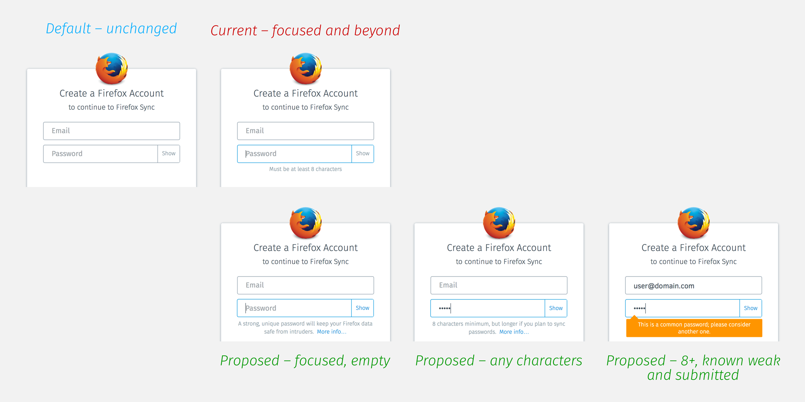

# Strengthening Passwords

## Problem Summary

[comment]: # (Talk about current goals of the system and how they aren't being met. What outcomes are we not delivering? This can also include an explicit request for improvement that doesn't dictate a specific or concrete solution.)

Users possess varying levels of understanding of what they are signing up for, and what is at risk. When syncing Firefox data (namely passwords) to a cloud-based account, reusing a password for their account puts them at greater risk to online attacks.

### Assumptions

[comment]: # (This is where you talk about what you assume to be true. This could include assumptions around what users are doing, errors, gaps, etc., based on anecdotes, opinions, testing, or data.)

Since account registration has appeared during First Run in an iframe, we are receiving are more users, but with less of an understanding of the significance of making an account. Since the Choose What To Sync screen has launched, we've noticed that First Run users are twice as likely to abandon during sign-up than users from other entry points.

## Outcomes

[comment]: # (What are the outcomes you want to achieve? What is the success criteria?)

We feel that we could better serve user security and our [Data Privacy Principles](https://www.mozilla.org/en-US/privacy/principles/) by being more transparent about the risks and benefits of signing up for an account. This will hopefully result in stronger passwords as measured by our bloom filter, and also result in fewer account sign-ups (as many users will realize it's not something they need or want). Another goal is increasing multi-device usage, which in turn should result in an increase in overall Firefox engagement.

## Hypothesis

[comment]: # (A high level hypothesis of how the feature you're proposing is going help us achieve the outcomes listed above. I recommend this be a sentence of the form. We believe that doing this building this creating this experience for these people will achieve this outcome. We will know this is true when we see this qualitative feedback quantitative feedback KPI change.)

We believe that providing more information about password strength for registering users will achieve stronger passwords. We will know this is true when we see a reduction in our bloom filter numbers.

We believe that providing more information about password strength for registering users will achieve greater awareness about password strength. We will know this is true when we survey new users and ask about passwords.

We believe that blocking known weak passwords will achieve stronger passwords. We will know this is true when we see a reduction in our bloom filter numbers.

We believe that these changes will result in us collecting only the data that benefits users. We will know this is true when we see a slight reduction in the number of new accounts.

## Metrics

[comment]: # (How are you going to measure the outcome / success? Please provide sample artifact graphs here.)

* Datadog Dashboard › FxA Content Server - Password Strength › % of users that hit each restriction
 * Fewer users hitting ALL_LETTERS_OR_NUMBERS and BLOOMFILTER_HIT
* Datadog Dashboard › FxA Content Server - Registration › % of too short passwords
 * Fewer users hitting TOO_SHORT
* Datadog Dashboard › FxA Content Server - Registration › Signup funnel
 * Slightly reduced signup rate

## Detailed design

[comment]: # (This is the bulk of the RFC. Explain the design in enough detail for somebody familiar with the language to understand. This should get into specifics and corner-cases, and include examples of how the feature is used.)

#### Password field give focus
When the user gives focus to the password field on the registration form, show instructions below that say:
* A strong, unique password will keep your Firefox data safe from intruders. <u>More info</u>.

"More info" will link to a modal dialog containing concise instructions on creating a strong password based on [this SUMO article](https://support.mozilla.org/en-US/kb/create-secure-passwords-keep-your-identity-safe)

#### User enters characters
When the user enters any characters, the instructions change to become:
* 8 characters minimum, but longer if you plan to sync passwords. <u>More info</u>.

#### Submitted password is on our blocklist
When the user enters a password that is on our blocklist, the UI will behave as if the password field were empty, and show the following error:
* This is a common password; please consider another one.  <u>More info</u>.

### Unresolved questions and risks

[comment]: # ( What parts of the design are still TBD?)
More info page copy.
